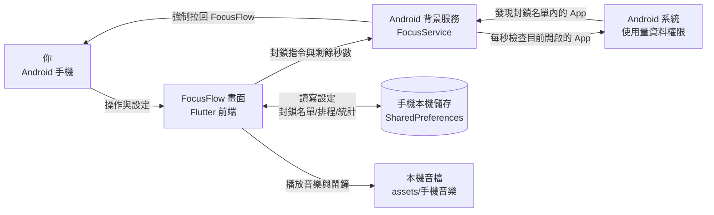

# FocusFlow（3c_detox）架構說明（給非工程師）

> 最後更新：2026/08/06

## 這個專案在做什麼？
FocusFlow 是一款手機 App（目前以 Android 為主），幫你「3C 戒毒」：在設定的專注時間內，自動封鎖你挑選的高干擾 App（例如社群軟體），一打開就被強制拉回 FocusFlow，並搭配番茄鐘、背景音樂與鬧鐘，營造不受打擾的專注環境。主要使用場景是讀書、工作、寫作業等需要暫時遠離手機的時刻。

## 怎麼使用？
1. **安裝與首次開啟**：把安裝檔（APK）裝到 Android 手機，打開 App 後會跳出權限說明視窗，需要照指示到手機設定中開啟 3 個權限：
   - 「顯示在其他應用程式上層」（懸浮窗權限）
   - 「使用量資料存取」（讓 App 能知道你正在開哪個 App）
   - 「電池不受限制」（避免背景封鎖服務被手機省電機制關掉）
2. **建立封鎖名單**：在「封鎖名單」頁面新增清單，勾選想封鎖的 App（例如 Instagram、YouTube）。
3. **開始專注**：在主畫面按下「開始專注」，可先設定專注時長（預設 30 分鐘）、開啟番茄鐘模式（每 25 分鐘專注＋5 分鐘休息）、嚴格模式、結束鬧鐘與背景音樂。專注期間若打開被封鎖的 App，畫面會被強制拉回 FocusFlow；手機頂部會持續顯示「專注進行中 剩下 00:00」的通知。
4. **設定自動排程（可選）**：在「排程」頁面設定每週固定時段（例如週一至週五 09:00–10:00），時間一到 App 會自動啟動專注模式。
5. **查看統計**：在「統計」頁面查看累計專注分鐘數與完成次數。
6. **中途放棄**：按「放棄」按鈕即可結束本次專注。

## 系統由哪些部分組成？
這個專案**沒有後端伺服器，也沒有雲端資料庫**——所有資料都只存在手機本機。組成如下：

- **前端（你看到的畫面）**：用 **Flutter**（Google 推出的跨平台 App 開發框架，一套程式碼可同時編譯成 Android、iOS、Windows、網頁版）撰寫。所有畫面都在 `lib/` 資料夾，例如主畫面（計時器）、封鎖名單頁、排程頁、統計頁、音樂清單頁。畫面文字支援**繁體中文、英文、日文**三種語言切換。
- **Android 原生層（背後的攔截引擎）**：封鎖其他 App 是 Android 系統層級才能做的事，所以專案裡有一段用 **Kotlin**（Android 官方程式語言）寫的原生程式碼，包含一個「背景服務」`FocusService`。它每秒檢查你現在正打開哪個 App（透過 Android 的「使用量資料」權限），若發現是封鎖名單裡的 App，就立刻把 FocusFlow 叫到最前面，擋住該 App。
- **資料庫（存放資料的地方）**：不是傳統資料庫，而是用 **SharedPreferences**（Android 提供的一種「本機偏好設定」儲存機制，實際以手機內的小型設定檔形式存在）。封鎖名單、排程、專注統計、音樂清單、鬧鐘與音樂開關等設定，全部存在這裡，App 關掉重開也不會消失。
- **兩層之間的橋樑**：Flutter 畫面要呼叫 Android 原生功能（例如啟動封鎖服務、讀取手機安裝的 App 清單）時，透過 **MethodChannel**（Flutter 提供的「App 程式碼 ↔ Android 原生程式碼」溝通管道）傳遞指令。

## 資料怎麼流動與儲存？
以「封鎖 Instagram」為例，一條完整的資料流是：

1. 你在封鎖名單頁面勾選 Instagram → 畫面把「Instagram 的套件名稱（package name）」加進封鎖名單，存入手機本機（SharedPreferences）→ 回傳「已儲存」，畫面上出現勾選狀態。
2. 你按下「開始專注」→ 畫面把「要封鎖的 App 清單＋剩餘秒數」透過橋樑送給 Android 原生層 → 原生層啟動背景服務，每 1 秒檢查一次目前開的 App。
3. 你嘗試打開 Instagram → 背景服務發現它在封鎖名單 → 系統強制跳回 FocusFlow 畫面 → 你看到自己被「拉回來」。
4. 倒數結束（或你按放棄）→ 畫面通知原生層停止服務 → 統計數字（總專注分鐘、完成次數）寫回本機儲存。

全程資料都在手機本機，**不會上傳到任何伺服器**。

## 登入與權限（如有）
**無**登入功能。App 不需要帳號、不需要網路連線即可使用。唯一的「權限」是 Android 系統權限（使用量資料存取、懸浮窗、電池不受限制、通知），用意是讓 App 有能力監看並攔截其他 App——這些權限由使用者首次開啟時手動授與，可隨時在手機設定中收回；若收回，封鎖功能會失效但 App 本身仍可開啟。

## 怎麼安裝到新裝置？
安裝到 Android 手機的步驟（以開發者角度）：

1. 準備一台安裝好 **Flutter SDK**（版本需支援 Dart SDK ^3.10.8）與 Android 開發環境（Android Studio／SDK）的電腦。
2. 在專案資料夾執行 `flutter pub get` 下載相依套件，再執行 `flutter build apk --release` 產生安裝檔，產出路徑為 `build/app/outputs/flutter-apk/app-release.apk`（專案更新紀錄顯示 2026-04-04 曾成功產出）。
3. 把 APK 傳到手機直接安裝（需允許「安裝未知來源的 App」）。
4. 若要正式對外發布（例如上架 Google Play），需要**簽章**：專案設定檔（`android/app/build.gradle.kts`）會讀取一個名為 `key.properties` 的簽章設定檔，**此檔不在 repo 內**（未發現），發布前需自行建立並妥善保管金鑰。
5. iOS／Windows／Web 資料夾也存在，但目前封鎖功能僅 Android 有效；iOS 若要上架需額外處理 Apple 的簽名與審核流程，repo 中未見相關準備。

## 怎麼備份與還原？
- **備份哪些東西**：封鎖名單、排程、專注統計、音樂清單、各項開關設定——都存於手機本機（SharedPreferences 設定檔）。
- **放哪裡**：只放在手機內部，**沒有雲端備份、沒有自動匯出功能**（repo 中未發現任何備份機制）。
- **多久一次**：無（從未自動備份）。
- **壞了怎麼還原**：沒有官方還原工具。若手機資料遺失（換機、移除 App、清除資料），設定會全部歸零，需重新建立封鎖名單與排程；統計數字也會從零開始。Android 系統自帶的整機備份（若使用者有開啟）可能涵蓋此 App 資料，但專案本身未針對此做任何設定或保證。

## 外部依賴清單
| 第三方服務 | 用途 | 免費／付費 | 金鑰或帳密放哪裡 | 如果服務倒了或改價會發生什麼 |
| :--- | :--- | :--- | :--- | :--- |
| Flutter／Dart（Google） | App 開發框架，整個 App 靠它建構 | 免費（開源） | 不需要金鑰 | App 無法再編譯更新，但已裝好的 App 不受影響 |
| pub.dev 套件：provider、shared_preferences、file_picker、audioplayers、google_fonts、flutter_launcher_icons | 狀態管理、本機儲存、選檔案、播音樂、字型、圖示 | 免費（開源） | 不需要金鑰 | 新版編譯可能失敗，可改用替代套件；既有 App 不受影響 |
| Google Fonts 字型伺服器 | 畫面字型（Inter）的下載來源 | 免費 | 不需要金鑰 | 離線時自動退回系統預設字型，App 仍可正常使用 |
| Android 系統（使用量資料、懸浮窗等權限） | 提供監看與攔截 App 的能力 | 免費 | 不需要金鑰 | Android 版本更新若調整權限規則，封鎖功能可能需要改寫 |

註：repo 內**未發現**任何 API 金鑰、伺服器、資料庫服務或付費服務。

## 風險提醒
| 風險項目 | 是否適用 | 目前怎麼處理 | 殘留風險 |
| :--- | :--- | :--- | :--- |
| API 金鑰／密碼外洩 | 否 | 專案不使用任何 API 金鑰或密碼；唯一相關的是發布簽章檔 `key.properties`（不在 repo 內） | 若發布者把簽章檔與金鑰放進 repo 或外洩，有心人可偽造更新版本 |
| 資料是否公開 | 否 | 所有資料只存手機本機，無雲端、無後端 | 手機本身遺失或被破解時資料才可能外洩 |
| 個人資料蒐集 | 是（輕微） | 會讀取「手機安裝的 App 清單」與「目前正在使用哪個 App」，僅在手機本機比對，**不上傳**；另會讀取本地音樂檔路徑 | 這些屬高敏感權限（使用量資料、所有檔案存取），若使用者誤授權給惡意 App 將有隱私風險；FocusFlow 本身設計上不蒐集 |
| 備份與還原缺口 | 是 | 無任何備份機制（見「怎麼備份與還原」） | 換機、清除資料後所有設定與統計永久遺失 |
| 金流相關 | 否 | 無任何付費、購買、訂閱功能 | 無 |
| 資料庫刪除或遷移 | 是（低風險） | 使用 SharedPreferences 本機儲存；App 啟動時會自動把舊版「黑名單」格式遷移成新版「封鎖清單」格式 | 手動清除 App 資料會全部歸零；無雲端遷移工具 |
| 部署與網路暴露 | 否 | 純本機 App，不部署伺服器、不對外開放任何網路服務 | 無 |
| 日誌含敏感資訊 | 否 | 程式只有簡單的除錯訊息（如音樂播放錯誤），未發現寫入日誌檔或上傳日誌的機制 | 無 |

## 壞了怎麼辦？
出問題時的檢查順序：

1. **封鎖沒生效** → 先確認 3 個權限是否還在（尤其「使用量資料存取」與「電池不受限制」）；部分手機的省電程式會自動關閉權限或砍掉背景服務。
2. **App 閃退或畫面異常** → 先完整關閉 App 再重開；仍異常就移除後重新安裝 APK。
3. **音樂不能播** → 音樂清單存的是檔案路徑，若音樂檔已從手機刪除，程式會自動跳過並播下一首（內建防呆）。
4. **排程沒自動啟動** → 確認排程開關有開啟、封鎖名單沒被刪改（被刪改的排程會自動停用並顯示紅色警告）。

自動糾錯機制：**無**監控告警、無健康檢查、無自動重啟腳本。唯一接近的保護是 Android 背景服務以 `START_STICKY` 模式運作，被系統暫時關閉時 Android 會嘗試重新拉起它；以及封鎖名單被刪改時，App 會自動停用相關排程並提醒使用者，避免排程誤用不存在的名單。

## 架構圖

## 名詞對照表
| 專有名詞 | 白話解釋 |
| :--- | :--- |
| App／APK | App 是應用程式；APK 是 Android 手機安裝程式的檔案格式（類似 Windows 的 .exe） |
| Flutter | Google 推出的跨平台 App 開發框架，寫一次程式可同時做出 Android／iOS／Windows／網頁版 |
| Dart | Flutter 使用的程式語言 |
| Kotlin | Android 官方程式語言，本專案用它寫「封鎖引擎」 |
| Android 原生層 | 直接與 Android 系統溝通的程式碼，能做到 Flutter 畫面做不到的系統級功能 |
| SharedPreferences | Android 的「本機偏好設定」儲存機制，把設定以小檔案存在手機裡 |
| MethodChannel | Flutter 畫面與 Android 原生程式碼之間的「溝通管道」 |
| 背景服務（Foreground Service） | 常駐在手機背景、會在通知欄顯示的程式；本 App 用它持續監看並攔截 App |
| 使用量資料存取（UsageStatsManager） | Android 權限，讓 App 知道「目前正在使用哪個 App」，是封鎖功能的關鍵 |
| 懸浮窗權限（SYSTEM_ALERT_WINDOW） | Android 權限，允許視窗顯示在其他 App 之上；本 App 用它把畫面拉回最前面 |
| 封鎖名單（BlockList） | 你勾選的「專注時不許打開」的 App 清單，可建多組 |
| 排程（Schedule） | 設定「每週幾、幾點到幾點自動進入專注」的規則 |
| 番茄鐘（Pomodoro） | 一種時間管理法：專注 25 分鐘＋休息 5 分鐘循環 |
| 嚴格模式（Strict Mode） | 排程自動啟動時強制開啟的封鎖狀態 |
| 套件名稱（package name） | 每個 Android App 的唯一識別碼（例如 Instagram 的識別碼），封鎖時以它來辨認 |
| Assets | 打包進 App 的靜態檔案（本專案含鬧鐘音效 retro_alarm.wav） |
| 多語言（i18n） | 介面文字支援多種語言切換（本專案為中、英、日） |
| Release 簽章（key.properties） | 發布 App 前用來「蓋章」證明版本真偽的金鑰檔，不在 repo 內、需自行保管 |
